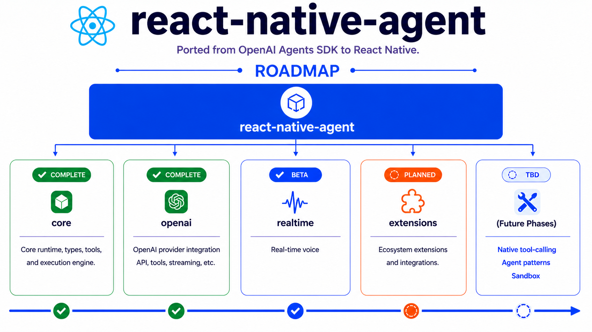

# React Native Agent

React Native Agent is a React Native port of the OpenAI Agents SDK for building multi-agent, realtime, and voice-powered AI applications on mobile.

Built with ❤️ by [reactnative.info](https://reactnative.info)



> [!NOTE]
> Check out the [OpenAI Agents SDK](https://github.com/openai/openai-agents-js).

> [!NOTE]
> Curious how the SDK works in action? Check out: [NewsFeed](https://play.google.com/store/apps/details?id=dev.newsfeed).


## Core concepts

1. [**Agents**](https://openai.github.io/openai-agents-js/guides/agents): LLMs configured with instructions, tools, guardrails, and handoffs
1. **[Agents as tools](https://openai.github.io/openai-agents-js/guides/tools/#4-agents-as-tools) / [Handoffs](https://openai.github.io/openai-agents-js/guides/handoffs/)**: Delegating to other agents for specific tasks
1. [**Tools**](https://openai.github.io/openai-agents-js/guides/tools/): Various Tools let agents take actions (functions, MCP, hosted tools)
1. [**Guardrails**](https://openai.github.io/openai-agents-js/guides/guardrails/): Configurable safety checks for input and output validation
1. [**Human in the loop**](https://openai.github.io/openai-agents-js/guides/human-in-the-loop/): Built-in mechanisms for involving humans across agent runs
1. [**Sessions**](https://openai.github.io/openai-agents-js/guides/sessions/): Automatic conversation history management across agent runs
1. [**Tracing**](https://openai.github.io/openai-agents-js/guides/tracing/): [Under work] Built-in tracking of agent runs, allowing you to view, debug and optimize your workflows
1. [**Realtime Agents**](https://openai.github.io/openai-agents-js/guides/voice-agents/quickstart/): [Under work] Build powerful voice agents with full features

Explore the [`examples/basic`](./examples/basic) directory to see the SDK in action.

## Get started

### Supported environments

React Native

### Installation

```bash
npm install react-native-agent
```

[!NOTE]
To enable text streaming in React Native, you need polyfills in `index.js`:
```
import { poly } from 'react-native-agent';
poly();
```

### Run your first agent

```js
    const openAIClient = new OpenAI({
        API_KEY, BASE_URL
    });
    const modelProvider = new OpenAIProvider({
        openAIClient,
    });

    setDefaultOpenAIClient(openAIClient);
    setOpenAIAPI('chat_completions');

    const agent = new Agent({
        name: 'Assistant',
        instructions: '',
        model: 'YOUR_MODEL',
        tools: [],
    });
    const runner = new Runner({ modelProvider });
    const result = await runner.run(agent, prompt, {
        signal: controller.signal,
    });

    console.log(result.finalOutput);
```

## Acknowledgements

We'd like to acknowledge the excellent work of the open-source community, especially:

- [OpenAI Agents SDK (JavaScript/TypeScript)](https://github.com/openai/openai-agents-js)
- [zod](https://github.com/colinhacks/zod) (schema validation)
- [Starlight](https://github.com/withastro/starlight)
- [vite](https://github.com/vitejs/vite) and [vitest](https://github.com/vitest-dev/vitest)
- [pnpm](https://pnpm.io/)
- [Next.js](https://github.com/vercel/next.js)
